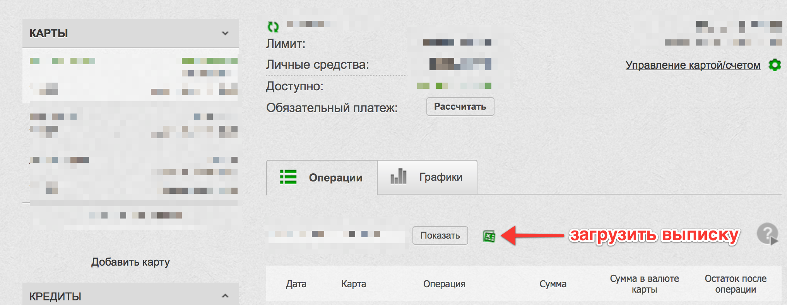

# privatbank2csv.rb

Скрипт для перевода файла выписок Приват24 в формат CSV, пригодный для обработки финансовыми программами - например, используемой мной [iBank](http://www.iggsoftware.com/ibank/).

## Где взять выписку?



## Как запустить скрипт?

```shell
bundle exec ruby privatbank2csv.rb statements.xls >statements.csv
```

Если вы не понимаете, что тут написано, но скрипт вам может быть полезен - пишите на leonid@shevtsov.me, что-нибудь придумаем.

## Что дальше делать?

Файл statements.csv состоит из таких колонок:

* дата и время в локальной зоне
* описание транзакции
* валютное преобразование + описание транзакции
* сумма транзакции **в валюте карты**

Если транзакция проводилась не в валюте карты - например, при покупках за границей или в Интернете - то в третьей колонке кроме описания будет сумма **в валюте транзакции** и актуальный курс.

Такой файл можно загрузить в вашу любимую финансовую программу (включая даже Numbers/Calc/Excel).

## Почему не Quicken QIF?

Формат QIF, вроде как, рассчитан для описания транзакций, но на практике сформировать правильный QIF-файл методом проб и ошибок не удалось, а документации к формату нет.

ⓒ 2014 [Leonid Shevtsov](http://leonid.shevtsov.me).
